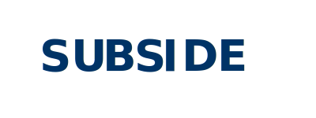

# Subsidence system for insight and data exploration (SUBSIDE)
<!--  # Add SOME kind of image here-->

Advancing Texas Subsidence Information Through Data Integration and Collaborative Science

SUBSIDE is a comprehensive data management and analysis platform developed through collaboration between the Texas Water Development Board (TWDB) and The University of Texas at Austin. The system provides centralized access to subsidence data collections across Texas, integrating diverse monitoring technologies including InSAR satellite imagery, GPS measurements, groundwater observations, models, reusable analysis tools, and extensometer data.  

SUBSIDE enables users to discover, analyze, and understand land subsidence patterns to support informed decision-making for water resource management, infrastructure planning, and hazard mitigation.

## Key Capabilities

- :material-database-search: **Centralized Data Discovery** 
: Access subsidence datasets from multiple sources in one location  

- :fontawesome-brands-nfc-directional: **Interactive Mapping** 
: Visualize subsidence patterns across Texas regions  

- :simple-simpleanalytics: **Advanced Analytics** 
: Automated quality assurance and analytical workflows  

- :material-head-check-outline: **Training Resources** 
: Educational materials and technical guidance  

- :simple-collaboraonline: **Collaborative Platform** 
: Connecting researchers, agencies, and stakeholders  

!!! Note "Content in Active Development" 
      Content pages for this section are in active development and should be released Fall 2025

## Terms and Conditions
### Prohibited Behavior  
As a condition of your use of SUBSIDE you agree not to upload any type of human data or personally identifiable information. Improper use of SUBSIDE, including uploading human data, may result in the termination of SUBSIDE access privileges.

### Data Sharing  
SUBSIDE conforms to the Information and Data Sharing Policy of the Texas Advanced Computing. Please see the SUBSIDE Data Policy page for more information.

### Responsibility for Data  
As a condition of your use of SUBSIDE you accept sole responsibility for all files you upload or transfer through use of SUBSIDE. You recognize and accept that SUBSIDE does not guarantee long-term retention of user uploaded data, and will not be responsible for any failure to store or transfer, or deletion, corruption or loss for any data, information or content contained in your files. It is strongly recommended that you backup all files prior to using SUBSIDE.

## Use Agreement
By using SUBSIDE, including its websites and services or via published APIs, you are agreeing to the terms stated in our Use Agreement. Please read them carefully. They include limitations on what is acceptable user behavior, accountability, availability, data retention, and conditions for account termination. If you do not agree, do not access or use SUBSIDE.

### Privacy Policy  
SUBSIDE is provided as a public service. SUBSIDE reserves the right to monitor any and all use of services. SUBSIDE never collects information for commercial marketing or any purpose unrelated to SUBSIDE functions. The Privacy Policy describes the ways SUBSIDE collects, stores, uses, discloses and protects the personal information about users and how they use SUBSIDE.

### Open Source License 
All software developed by the SUBSIDE project team, and any contributed by you to SUBSIDE, is stored and maintained in the public SUBSIDE data discovery service (e.g. ckan.tacc.utexas.edu), DataX portal (ptdatax.tacc.utexas.edu), or GitHub code repository under the BSD-3 clause license (“License”). By contributing to or using SUBSIDE, you acknowledge having read and understood the License and agree to abide by it.

## Data Policy
SUBSIDE conforms to the Information and Data Sharing Policy of the Texas Water Development Board (TWDB) and Texas Advanced Computing Center. The SUBSIDE services require that all publishable data, metadata, and software resulting from research funded by the TWDB must conform to community-recognized standard formats when they exist; be clearly attributable; and be deposited within a community-recognized public database(s) appropriate for the research.

Data publicly available in SUBSIDE comes from the sources listed on this page. Additionally, users can upload their own data to SUBSIDE to analyze it, and can choose how widely their data should be shared. All data uploaded by users is private to them unless they choose to share it.

!!! NOTICE 
      SUBSIDE does not guarantee long-term retention of user-uploaded data. Please take appropriate precautions in storing and backing up your data locally.

!!! WARNING 
      Improper use of SUBSIDE, including uploading human data, may result in the termination of SUBSIDE access privileges. Please see the Terms and Conditions page for more information.

